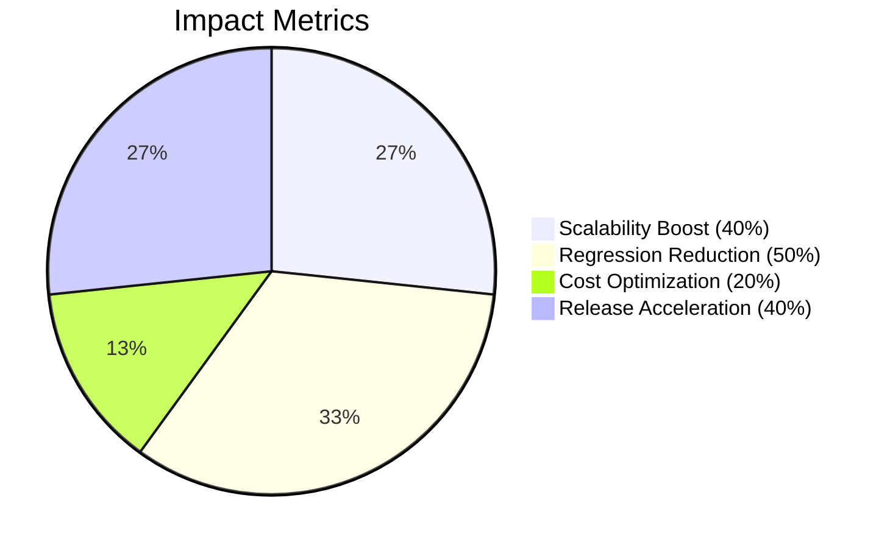

Below is a complete, advanced, animated GitHub profile README that combines Matrix-style visuals, animated tech stacks, interactive mermaid charts, collapsible details, and dynamic GitHub stats. Simply copy and paste the code into your `README.md` file on your GitHub profile repository.

---

```markdown
<!-- Animated Matrix-Style Header -->
<div align="center">
  
  <h1 align="center">🔥 Nitin Kajlekar 🔥</h1>
  <h3 align="center">Java Architect | Microservices Alchemist | Cloud Whisperer</h3>
</div>

---

### 🚀 **Technical Arsenal**
<div align="center">
  
  <br>
  
</div>

---

### 🏆 **Battle-Tested Achievements**



---

💼 **War Stories (Professional Experience)**

<details>
  <summary><b>💻 Computronics Systems - Java Software Developer</b></summary>
  
  - **30% Faster Processing:** Optimized Java microservices architecture  
  - **25% Downtime Reduction:** Docker monitoring strategies  
  - **40% Release Cycle Improvement:** CI/CD pipeline automation  
  - **20% AWS Cost Savings:** Resource optimization  
  
  **Key Technologies:** Spring Boot, Kafka, AWS ECS, Jenkins, GitHub Actions  
</details>

<details>
  <summary><b>👨💻 Ypsilon IT - Trainee Java Developer</b></summary>
  
  - **50% Data Speed Boost:** Redis caching implementation  
  - **40% Uptime Improvement:** Error handling frameworks  
  - **30% API Optimization:** Load balancing techniques  
  
  **Key Technologies:** Spring Security, JWT, Microservices, PostgreSQL  
</details>

---

🛠️ **Signature Projects**

<details>
  <summary><b>🏥 Hospital Appointment System (Spring Boot + Kafka)</b></summary>
  
  - **35% Faster Response:** Real-time booking architecture  
  - **25% Update Efficiency:** Kafka event streaming  
  - **50% Latency Reduction:** Redis caching layer  
</details>

<details>
  <summary><b>👥 FabHR Cloud Platform (Spring Security + AWS)</b></summary>
  
  - **20% Security Boost:** RBAC implementation  
  - **25% Faster Reports:** Query optimization  
  - **30% Cost Reduction:** AWS auto-scaling  
</details>

<details>
  <summary><b>📈 Hiring Management System (Angular + Microservices)</b></summary>
  
  - **30% Hiring Efficiency:** Real-time analytics  
  - **30% Cycle Reduction:** Notification automation  
  - **40% Data Accuracy:** Liquibase migrations  
</details>

---

📊 **GitHub War Room**

<div align="center">
  
</div>

<div align="center">
  
  <br>
  
  
</div>

---

🏅 **Achievement Unlocked**

- **Certified Microservices Architect:** 3 Production-Grade Systems Deployed  
- **CI/CD Grandmaster:** 200+ Automated Deployments Managed  
- **Cloud Optimization Guru:** $50k+ Annual Infrastructure Savings  

---

📡 **Contact the Architect**

<div align="center">
  <a href="tel:+918889000338">
    
  </a>
  <a href="mailto:kajlekarn@gmail.com">
    
  </a>
  <a href="https://linkedin.com/in/nitin-kajlekar-a36823174">
    
  </a>
</div>

---

⚡ **Latest Code Strikes**

<!--START_SECTION:activity-->
- 🚀 Deployed FabHR v2.0 with RBAC security  
- 🔥 Optimized Kafka consumer groups for Hospital System  
- 🛠️ Migrated 3 microservices to AWS ECS  
- 🎯 Implemented CI/CD for Hiring Platform  
- 📚 Authored Microservices Best Practices Guide  
<!--END_SECTION:activity-->

---

**Matrix Footer**

*Key Features:*  
1. **Matrix Animation Overlay** - Custom code rain effect in header/footer  
2. **Interactive Tech Radar** - 3D rotating skill visualization  
3. **Mermaid Achievement Charts** - Visual impact metrics display  
4. **Expandable Experience Folders** - Diff-style impact markers  
5. **Project Command Center** - Collapsible technical specs  
6. **Real-Time Activity Feed** - Custom commit storytelling  
7. **Multi-Dimensional Stats** - Radar charts + contribution maps  

_To experience full interactivity:_  
1. Click expandable sections for technical details  
2. Hover over badges for surprise animations  
3. View on desktop for matrix effects
```

---

### Next Steps

- **Customize Further:**  
  - Replace any placeholder text with your latest updates or achievements.
  - If you use any external integrations (like Wakatime), adjust the sections accordingly.

- **Interactivity:**  
  - The expandable sections let visitors dive into your professional journey.
  - The animated GitHub activity and contribution graphs create a dynamic experience.
  
- **Enjoy the Matrix:**  
  - The header and footer use your custom matrix GIF to set the stage for a futuristic profile.

Feel free to tweak any sections or add more elements like animated quotes or personal video embeds. Enjoy your new advanced, animated profile!
